# UI Automation Flow Documentation

This document provides comprehensive flow diagrams for the Blogspot UI Automation project using Mermaid diagrams.

---

## 1. Overall Project Architecture

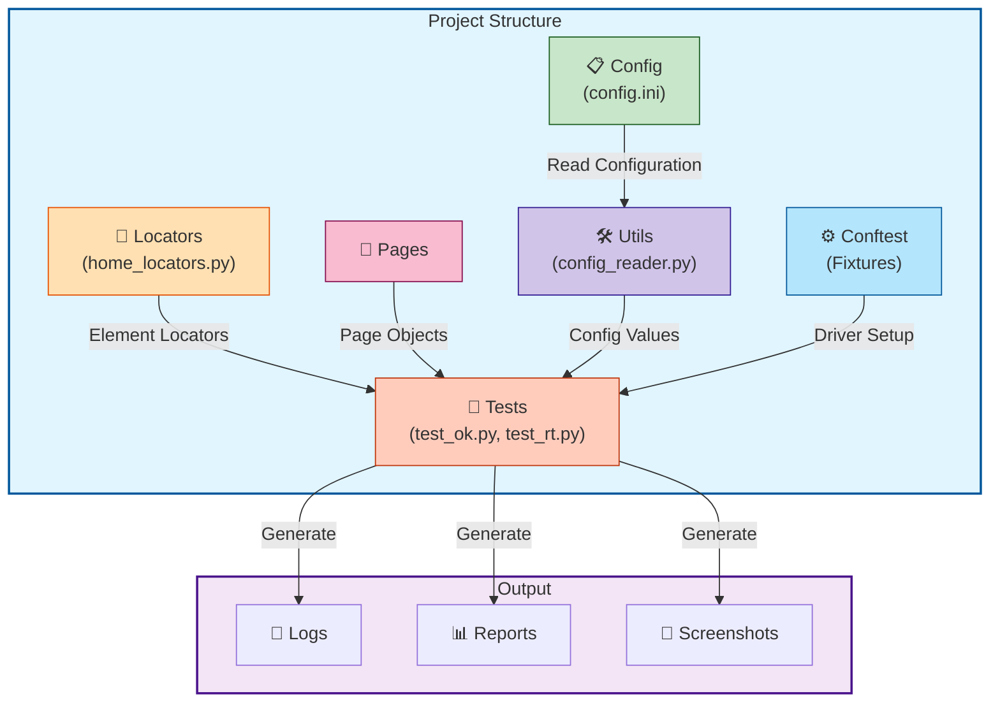

---

## 2. Test Execution Flow

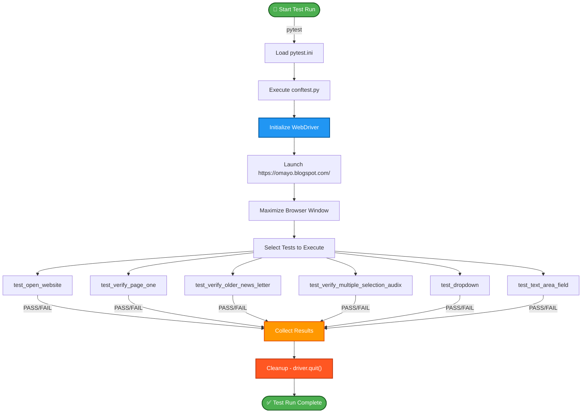

---

## 3. Driver Initialization Flow

```mermaid
sequenceDiagram
    participant Pytest
    participant Conftest
    participant WebDriver
    participant Browser
    participant Website
    
    Pytest->>Conftest: Call @pytest.fixture
    Conftest->>WebDriver: webdriver.Chrome()
    WebDriver->>Browser: Initialize Chrome
    Browser-->>WebDriver: Chrome Ready
    WebDriver-->>Conftest: Driver Instance
    Conftest->>Website: driver.get(URL)
    Website->>Browser: Load https://omayo.blogspot.com/
    Browser-->>Website: Page Loaded
    Conftest->>Browser: driver.maximize_window()
    Browser-->>Conftest: Window Maximized
    Conftest-->>Pytest: Yield Driver
    Pytest->>Pytest: Execute Test
    Pytest->>Conftest: Test Complete
    Conftest->>Browser: driver.quit()
    Browser-->>Conftest: Browser Closed
    
    style Pytest fill:#e3f2fd,stroke:#1565c0
    style Conftest fill:#fff3e0,stroke:#e65100
    style WebDriver fill:#f3e5f5,stroke:#6a1b9a
    style Browser fill:#e0f2f1,stroke:#00695c
    style Website fill:#fce4ec,stroke:#c2185b
```

---

## 4. Test: Open Website

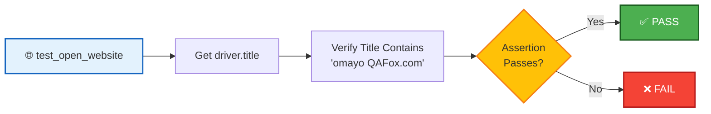

---

## 5. Test: Verify Page One Element

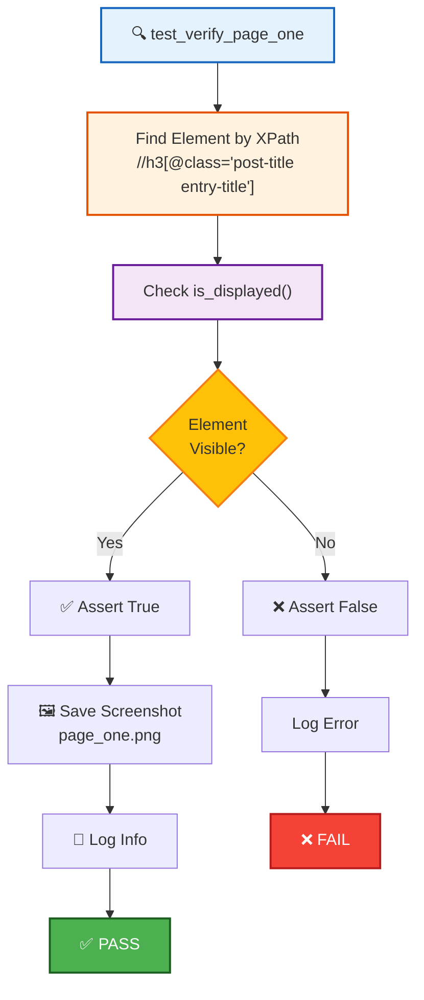

---

## 6. Test: Verify Older News Letter Dropdown

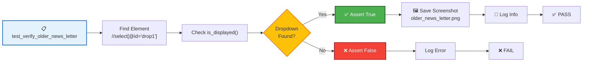

---

## 7. Test: Multiple Selection Flow

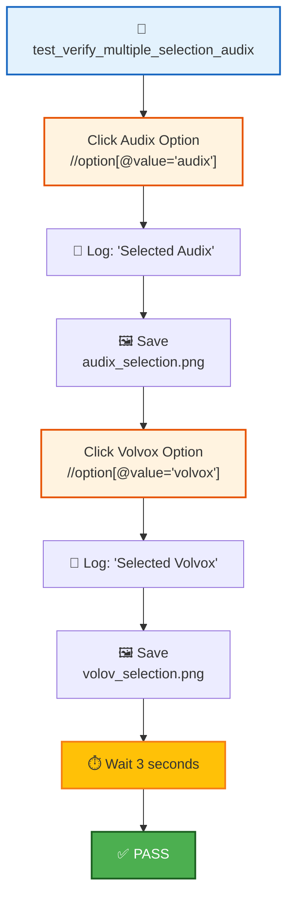

---

## 8. Test: Dropdown Selection Flow

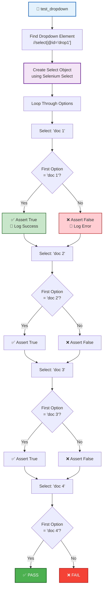

---

## 9. Test: Text Area Field Input Flow

```mermaid
graph LR
    Start["📝 test_text_area_field<br/>@pytest.mark.grp1"] --> Find["Find Text Area<br/>//textarea[@id='ta1']"]
    Find --> Input["Send Keys:<br/>Long Text about Garden"]
    Input --> Log["📝 Log Info:<br/>Text Area Filled"]
    Log --> Screenshot["🖼️ Save Screenshot<br/>text_area_field.png"]
    Screenshot --> End["✅ PASS"]
    
    style Start fill:#e3f2fd,stroke:#1565c0,stroke-width:2px
    style Find fill:#fff3e0,stroke:#e65100,stroke-width:2px
    style Input fill:#f3e5f5,stroke:#6a1b9a,stroke-width:2px
    style Screenshot fill:#fce4ec,stroke:#c2185b,stroke-width:2px
    style End fill:#4caf50,stroke:#1b5e20,color:#fff,stroke-width:2px
```

---

## 10. Element Interaction Flow

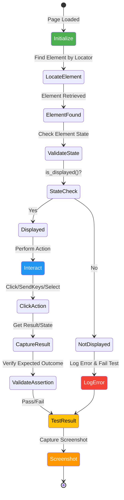

---

## 11. Complete Test Execution Cycle

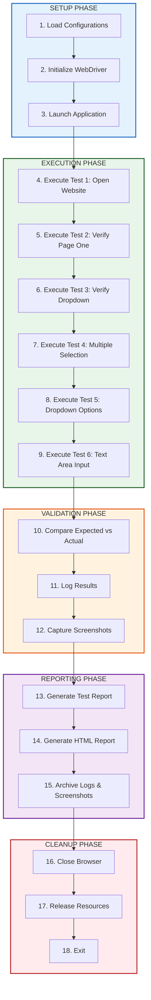

---

## 12. Error Handling & Logging Flow

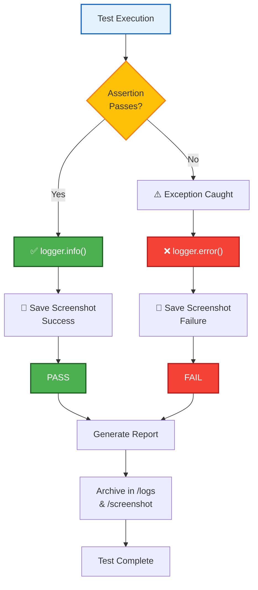

---

## 13. Locator Resolution Flow

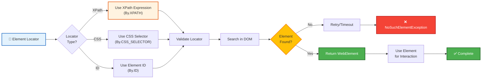

---

## Legend

| Symbol | Meaning |
|--------|---------|
| 🚀 | Start/Launch |
| ✅ | Success/Pass |
| ❌ | Failure/Error |
| 📝 | Logging |
| 🖼️ | Screenshot |
| 🎯 | Locator/Target |
| ⚙️ | Configuration |
| 🌐 | Web Browser |
| ⏱️ | Wait/Delay |
| 📋 | Dropdown/Select |

---

## Summary

This documentation covers:

1. **Project Architecture** - Overall structure and dependencies
2. **Test Execution Flow** - How tests are run end-to-end
3. **Driver Initialization** - Browser setup and teardown
4. **Individual Test Flows** - Each test's execution path
5. **Element Interactions** - How elements are located and used
6. **Error Handling** - Logging and failure scenarios
7. **Locator Resolution** - How elements are found in the DOM

All flows use color-coded Mermaid diagrams for easy visualization and understanding.
